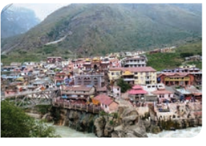

Greetings, traveller. You looked tired and cold. 

Are you a stranger to these parts? Waiting for the bus to Badrinath? Perhaps, you are a pilgrim or a visitor to the Valley of Flowers?

 Anyway, whoever you are, come with me. Wait at my teashop. It is just past the bend in the road.

 As you can see, I am carrying this can of milk to the shop. In ten minutes, I will have a fire going. While you warm yourself, I will prepare for you the best cup of tea in all Garhwal. It will chase away the pinched, blue look from your face. 

Here we are. Welcome to my humble roadside teashop. Make yourself comfortable on this wooden bench. It looks **rickety** but it will hold your weight.

My name, Sir? I am called Brij. I am seventeen years old. I started this tea shop two years ago. 

Before that I worked in a roadside shop outside Panipat. The heat, the crowd, the pollution – it was all too much. I had saved most of my earnings. I came back and with a little help I started this shop. By the grace of God, it provides me a decent enough livelihood.

 Here, your tea is ready – strong, sweet, flavoured with cardamom. Enjoy it, Sir, while I get on with my chores. This is my daily routine. At sunset, I will shut my shop and walk back the three miles to my dwelling on the hillside.

 The name of my village?

 It was my village. The village of my ancestors.

 It is no more. Molthi is gone. 

What happened to my village?

It was four years ago, in the month of October. One night the earth quaked. Yes, tremors are common in these parts. These snows may seem eternal, the Himalayas may look solid, but the truth is, deep down they are unstable. We, who live here, are accustomed to **tremors**. 

But what happened that night was more than that. It was a terrible earthquake. Its effects were felt as far away as Delhi and Lucknow. 

Can you imagine the **devastation** at the heart of the earthquake?

 The epicentre was in a valley not far from here. There were six hundred and seventy villages in the valley. Six hundred and two were destroyed. The earthquake lasted less than five minutes. Time enough to set these centuriesold mountains crashing, to reduce our villages to rubble, to snuff out hundreds of lives.

 It was sheer chance that I was away that night. I had gone to Pauri to

buy my school books. I stayed the night at my uncle’s house. We felt the tremors. We ran out into the open. Again and again the tremors came. We spent the entire night outside. Pauri lived through the night. Molthi did not.

For the living, the nightmare began at daybreak when the news trickled in of the large-scale devastation. There were dozens of landslides. Huge boulders thrown **haphazardly** across motorable tracks and roads. Precious time was spent in blasting the rocks and clearing the way for Army rescue teams. It was all of four days before help arrived for Molthi.

 I was among the first to reach the village. My uncle accompanied me. We feared the worst, but nothing had prepared us for what we saw. Every single house, every wall, every roof had been flattened. Stone, rubble and dust were all that remained. Our house was a two-storeyed stone building with a slate roof. My great grandfather had built the house. We were a small family. My father had died after an illness, just fourteen months ago. My mother took care of us. We were three children. I was the oldest. My brother Nilu was ten. Bhuli, my two-year-old sister, was the baby of the family. My grandmother lived with us. 

When the soldiers began to clear the **debris**, my uncle led me away. I was in a complete daze, too numb to feel anything. The soldiers had set up a makeshift camp. Someone gave me tea and biscuits. I don’t know how long I was there. Suddenly it was evening and uncle was standing beside me. “They

have taken the bodies to the river bank,” he said gently. “Come, you must perform the last rites before sunset. Tomorrow, we will go back to Pauri.”

I had last seen my family while leaving for Pauri. They stood at the doorway and waved. Ma, Grandma, Nilu and Bhuli. That is the way I will always remember them – smiling and waving at me. Not as the **white-shrouded** lifeless figures I saw.

 Bhuli? She was not there.

“They have not found her,” my uncle said. “The wild animals …Brij, don’t look like that! She is dead.”

 “But we must find her,” I shouted.

 “Brij…get a grip on yourself," uncle pleaded.

 But I was beyond reasoning. I ran back to the village, to the spot where my house had stood. 

There was still so much debris. I scrambled around shifting the earth and stones. How long I was on my knees searching, crying, searching… 

“Boy, it is no use” a voice said. I looked up. The speaker was the Army Officer who had supervised the relief operation. “There is no one alive in there,” he said, “whom are you looking for?” 

“My sister, Sir,” I said, fighting to control my tears, “All I want is to give her a proper cremation.” I stopped, conscious that I was babbling. I could see that he was bonetired. He looked as if he had not slept for days. His uniform was covered with dust, his face was grimy. But through all the dust and grime, I saw that his eyes were kind.

“My men have been on their feet for days," he said softly, as if talking to himself. “They have done all they could here. Tomorrow, at daybreak, we go to another village just like this, then another. He looked away at the sun setting behind the peaks. Down, in the valley, the **pyres** burnt, row upon row. The officer muttered something, shook his head and turned away. A terrible despair engulfed me. I lay there among the ruins of my house and cried.

Ten minutes later, the officer was back. With him were three soldiers armed with spades and crowbars. Without a word, the men began, removing the debris. They laboured doggedly. When it was completely dark, someone brought a few lit petromax lamps. Two hours later, a soldier called out, “Sir!”

 He stood in the middle of a small hollow. The wall had caved in at that spot. I recognized a part of a door. Beneath it, a small foot.

 Feverishly the soldiers began to clear the hollow. Then, they lifted the door.

 “She is alive!” someone said. 

It was a miracle. She had been buried under the debris for a hundred and sixteen hours. She had survived the earthquake, the cold nights and the wild animals. A ragged cheer went up and the soldier wrapped her in a warm blanket and carried her to the tent where a makeshift hospital had been set up. Bhuli lived. The next day I went to thank the Army Officer. But he was gone. I did not even know his name.

My sister and I went on to live with my uncle. Soon after, I got a job at a dhaba near Panipat. Bhuli stayed back. She started going to school. It weighted on me that I never thanked that Army Officer. I hoped that one day I would run into him again. Every time I saw an army man, I would hope it was him. For months I would search for his face in every crowd. And one day, I did find him.

 It was late on a winter’s night. A truck stopped at the shop. A man got out. He looked familiar. When he stepped into the light, I saw that it was not him, just someone who bore a strong resemblance. The man was tired. He asked for a cup of tea. As I served him, Sir, I felt this strange lightness. This sense of joy. When the man offered to pay, I did not take the money. The next day, it happened again. Every day, I would see someone, a complete stranger, a tired traveller, who reminded me of that officer. It was as if he was everywhere. And every time I served him tea, I felt a surge of sheer joy.

 A month later, I quit my job at the shop and returned to those mountains.

The shop owner was quite relieved. He had no use for a waiter who kept forgetting to present the bill to the customer. Now I am on my own. And I am at peace. 

Here is your bus, Sir. No, no money… you were tired. All I offered you was a cup of tea. Maybe it was the best tea in all Garhwal. Maybe not. But I am happy I could do you this small service. Wish you a safe journey, Sir. May God be with you!

