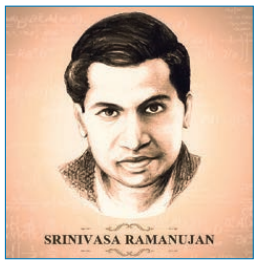

The arithmetic class was in progress. The teacher was solving questions on division. On the blackboard were drawn three bananas. “We have three bananas,”

 the teacher said, “and we have three boys. Can you tell me how many each will get?”

 A smart boy in the front row replied, “Each will get one.”

 “Right,” the teacher said. “Now, similarly, if 1,000 bananas are distributed among 1,000 boys, each will get one, isn’t that so?”

 While the teacher was explaining, a boy sitting in one corner raised his hand and stood up. The teacher stopped and waited for the boy to speak.

 “Sir,” the boy asked, “If no banana is distributed among no one, will everyone still get one banana?” There was a roar of laughter in the class. What a silly question to ask!

“Quiet!” the teacher said loudly and thumped the desk. “There’s nothing to laugh at. I will just explain what he means to say. For the division of bananas, we divided three by three, saying that each boy will get one banana. Similarly, we divided 1,000 by 1,000 to get one. What he is asking is that if zero banana is divided among zero, will each one get one? The answer is ‘no’. Mathematically, each will get an infinite number of bananas!”

Everyone laughed again. The boys understood the trick, arithmetic had played upon them. What they could not understand was why the teacher later complimented the boy who had asked that **absurd** question. 

The boy had asked a question that had taken mathematicians several centuries to answer. Some mathematicians claimed that zero divided by zero was zero. Others claimed it to be unity. It was the Indian mathematician Bhaskara who proved that it is **infinity**. The boy who asked the **intriguing** question was Srinivasa Ramanujan. Throughout his life, whether in his native Kumbakonam or Cambridge, he was always ahead of his mathematics teachers.

**** What was the reaction of the classmates to Ramanujan’s question? 
**** What did the Indian mathematician Bhaskara prove?

Ramanujan was born in Erode in Tamil Nadu on December 22, 1887. His father was a petty clerk in a cloth shop. From early childhood it was evident that he was a **prodigy**. Senior students used to go to his **dingy** house to get their difficulties in mathematics solved. At the age of 13, Ramanujan was lent a book on advanced trigonometry written by S.L. Loney. Not only did he master this rather difficult book but also began his own research. He came forth with many mathematical theorems and formulae not given in the book, though they had been discovered much earlier by great mathematicians. 

The most significant turn came two years later when one of his senior friends showed him the book A Synopsis of Elementary Results in Pure Applied Mathematics, a collection of 4,865 formulas and theorems without proof by G.S. Carr. For a boy of 16 the title itself must be frightening, but Ramanujan was delighted. He took the book home and began to work on the problems given in it. This book triggered the mathematical genius in him.

 Mathematical ideas began to come in such a flood to his mind that he was not able to write all of them down. He used to do problems on loose sheets of paper or on a slate and jot the results down in notebooks. Before he went abroad he had filled three notebooks, which later became famous as Ramanujan’s Frayed Notebooks.

**** Where did Ramanujan get S.L. Loney’s book on Trigonometry? 
**** Where did Ramanujan do his mathematical problems?

Although Ramanujan secured a first class in Mathematics in the matriculation examination and was awarded the Subramanyan Scholarship, he failed twice in his first-year arts examination in college, as he neglected other subjects such as History, English and **Physiology**. This disappointed his father. When he found the boy always scribbling numbers and not doing much else, he thought Ramanujan had gone mad.

 Ramanujan began to look for a job. He had to find money not only for food but for papers as well to do his calculations. He needed about 2,000 sheets of paper every month. Ramanujan started using even scraps of paper he found lying on the streets. Sometimes he used a red pen to write over what was written in blue ink on the piece of paper he had picked up.

**Unkempt** and **uncouth,**  he would visit offices, showing everyone his frayed notebooks and telling them that he knew mathematics and could do a clerical job. But no one could understand what was written in the notebooks and his applications for jobs were turned down.

 Luckily for him, he at last found someone who was impressed by his notebooks. He was the Director of Madras Port Trust, Francis Spring, and he gave Ramanujan a clerical job on a monthly salary of ₹25. Later some teachers and educationists interested in Mathematics initiated a move to provide Ramanujan with a research fellowship. On May 1, 1913, the University of Madras granted him a fellowship of ₹75 a month, though he had no qualifying degree.

**** What were the subjects neglected by Ramanujan in college? 
**** Which University granted him a fellowship of ₹75 a month?

A few months earlier, Ramanujan had sent a letter to the great mathematician G. H. Hardy, of Cambridge University, in which he set out 120 theorems and formulae. Among them was what is known as the Reimann Series, a topic in the definite integral of Calculus. But Ramanujan was ignorant of the work of the German mathematician, George F. Riemann, who had earlier arrived at the series, a rare achievement. Also included was Ramanujan’s **conjecture** about the kind of equations called “modular”. Pierre Deligne subsequently proved this conjecture to be correct. 

It did not take long for Hardy and his colleague, J.E. Littlewood, to realise that they had discovered a rare mathematical genius. They made arrangements for Ramanujan’s passage and stay at Cambridge University. On March 17, 1914, he sailed for Britain.

**** What did Ramanujan send to G.H. Hardy? 
**** Who discovered a rare mathematical genius in Ramanujan?

Ramanujan found himself a stranger at Cambridge. The cold was hard to bear and being a vegetarian, he had to cook his own food. However, he continued his research in Mathematics with determination. In the company of Hardy and Littlewood, he could forget much of the hardship he had to endure.

 In Ramanujan, Hardy found an unsystematic mathematician, similar to one who knows the Pythagorus theorem but does not know what a congruent triangle means. Several **discrepancies** in his research could be attributed to his lack of formal education. Ramanujan played with numbers, as a child would with a toy. It was sheer genius that led him to mathematical “truths”. The task of proving them, so important in Science, he left to lesser mortals.

Ramanujan was elected, Fellow of the Royal Society on February 28, 1918. He was the youngest Indian to receive this **distinguished** fellowship. In October that year he became the first Indian to be elected Fellow of Trinity College, Cambridge. His achievements at Cambridge include the Hardy-Ramanujan-Littlewood circle method in number theory, Roger-Ramanujan’s identities in partition of integers, a long list of the highest composite numbers, besides work on the number theory and the algebra of inequalities. In algebra his work on continued fractions is considered to be equal in importance to that of great mathematicians like Leonard Euler and Jacobi.

 While Ramanujan continued his research work, Tuberculosis, then an incurable disease, was **devouring** him. Ramanujan was sent back to India and when he **disembarked**, his friends found him pale, exhausted and **emaciated**. To forget the **agonising** pain, he continued to play with numbers even on his death bed. 

Besides being a mathematician, Ramanujan was an astrologer of repute and a good speaker. He used to give lectures on subjects like “God, Zero and Infinity”.

