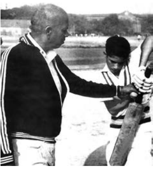
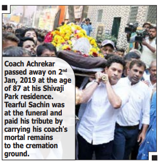

From a very early age, I played tennis-ball
cricket with my colony friends. I loved watching cricket on television and in our games, I often tried to ***emulate** the mannerisms of my favourite players, Sunil Gavaskar and the West Indian legend Viv Richards. But it wasn’t just the batsmen that I studied. I also loved bowling. Throughout my career, I have actually bowled a lot in the nets.

I was then studying in the New English School, Mumbai. But my brother Ajit knew that compared to other schools in Mumbai, Shardashram Vidhyamandir where Ramakant Achrekar Sir was the cricket coach, gave due importance to the game of cricket. He ran summer camps too. Ajit, one day, took me to the camp to get trained under Sir. Anyone could come for a trial at the camp; but then, it was up to Sir to decide who to accept. I was eleven years old then. Achrekar Sir, as I refer to him, started playing cricket at the age of eleven in 1943, which is the age I was when I went to him for the first time.

**•** Who were Sachin’s favourite players?
**•** What was special about Shardashram
Vidyamandir in Mumbai?

I had never batted in the nets before and felt somewhat **overawed** with so many people around. When I was asked to bat, I was not at all comfortable. With Sir watching me so closely, I failed to make an impact. Sir called Ajit aside and informed him that I was perhaps too young to make the camp and suggested that he should bring me back when I was a little older. My **induction** into the Mumbai cricket circuit could have ended in failure – but for Ajit’s insistence. Having seen me play in the colony, Ajit knew I was capable of performing far better than I had done in front of Achrekar Sir. He explained that I was nervous and asked Sir to give me one more opportunity. However, he suggested that while doing so, Sir should pretend to go away and then watch from a distance. Sir agreed. Before long, I was asked to bat again and, without Sir’s trained 

eyes scrutinizing me – or so I thought, I felt more at ease and soon started to hit the ball well. This time, Sir agreed to let me join the camp. I was delighted and I must say it was an opportunity that transformed my life.

The camp involved a session every morning and evening at Shivaji Park. I would practice between 7.30 am and 10.30 am in the morning. Then I’d come back in the afternoon and practice till late evening The schedule was **rigorous** and I would be exhausted by the end of the day. Travelling to Shivaji Park took forty minutes from my house in Bandra and I had to catch an early morning bus to make it on time. For the first few days, Ajit accompanied me, to get me used to the routine. During the bus journeys, he would talk to me about the **nuances** of batting, and I always enjoyed these conversations a lot. In fact, the one thing that I have kept with me all my career is a note that Ajit gave me containing some thoughts about batting. It served as a very personal coaching manual.

**•** What was the opportunity that transformed the life of Sachin?
**•** What sort of conversations did Ajit and Sachin have while travelling?

As a child, I had only one set of cricket clothes and the routine was to wash them as soon as I’d returned from the morning session. While I had my lunch, the clothes would dry out in the sun and I would wear them again in the afternoon. The pattern was repeated in the evening so that I could use the same set of clothes the following morning. The system worked well – apart from my pockets. There was never quite enough time for the pockets to dry out completely, and for the entire duration of the camp I played with wet pockets. By the middle of the summer camp, Sir had started taking an active interest in my batting and at the end of the two months, informed Ajit that I had the potential to be a good cricketer if I practiced all year round. However, my school – the New English School in Bandra – did not have cricket facilities and Sir was keen for me to change schools if I wanted to **pursue** cricket seriously.

**•** What routine did Sachin follow in
washing his clothes?
**•** What did Achrekar inform Ajit?

One evening, Sir called my father and put forward his suggestion. Ajit was in the room with my father at the time and they both accepted that it was necessary if cricket was to be my priority. My father sat me down and explained that while he did not have any objections to my changing schools, I should do so only if I was really serious about playing cricket.I assured him I was, and so it was agreed that I should move to Shardashram Vidhyamandir, where Achrekar Sir was the cricket coach. All my excess energies were getting channelled into cricket, which acted as a kind of safety valve. My father always said that all he wanted me to do was give it my best effort without worrying about the results.

**•** What was the suggestion given by Achrekar to Sachin’s father? 
**•** What acted as a safety valve?

In my first year at Shardashram, I played fifty five practice matches during the summer break of sixty days. My summer sessions used to start at 7.30 am and end at 4.30 pm. My evening session would start at 5 pm after only a thirty-minute break. During the break, Sir would often give me some money to go and have a vadapav (a popular Mumbai fast food).

Between 5 pm and 7 pm I’d have five more net sessions. Towards the last 15 minutes, Sir would place a one rupee coin on top of the stumps and if I managed to avoid getting out, the coin was mine. In this session every bowler in the camp would come and bowl to me, with some sixty to seventy boys fielding. It meant I had to hit every ball along the ground to survive those intense fifteen minutes. Winning the one–rupee coin used to give me immense satisfaction and taught me how to concentrate even when physically drained. At the end of it all., Sir would tell me to run two full circuits of Shivaji Park with my pads and gloves on.

That was the last part of my training and I’d be completely exhausted by the end of it all. It was a routine I would repeat right through my summer holidays and it helped me to build up physical and mental **stamina.** 

**•** What did Sachin do during the thirty minute break? 
**•** What is the intense ‘fifteen minutes’ mentioned ?

 Occasionally, my father came to take me home and I would always ask him to treat me to a special fruit **cocktail** at a juice centre near the club. While this regular demand was a little unreasonable, because at the time I did not realize that my parents also had to take care of the needs of my brothers and sister, my father would invariably end up giving me what I wanted, just to see me happy. On other days, when I made my way home from Shivaji Park on my own, I’d often fall asleep on the bus – if I managed to sit down. Anyone who has been on a Mumbai bus at peak hours will know just how difficult it is to get a seat. On days when I wasn’t so lucky, it was still a challenge just to stand with the **kitbag**, because the bus conductors would inevitably complain about me taking up the space of another passenger. It could be embarrassing because the conductors were often rude and would sometimes ask me to buy two tickets. I didn’t have the money for a second ticket and I had to learn to take these remarks in my **stride**. Dirty clothes often added to the **embarrassment.** With time, I evolved a way of wrapping the kitbag around me. Just as the helmet and 

 pads became a part of me while batting, so the kitbag became an extension of me on the bus. I’d often take the bus or train from Bandra to Church gate, and it was all a great learning experience. 

**•** What did Sachin’s father do just to make Sachin happy? 
**•** What did embarrass Sachin in the bus? 

Even though I loved cricket, there were still occasional days when playing with my friends at home was such fun that I would conveniently forget I was supposed to go to the nets. If I didn’t turn up, Achrekar Sir would jump on to his scooter and come to find me. Sir would spot me in the **melee** and virtually drag me out. I would come up with excuses but he would have none of it. He would get me to change and head off to Shivaji Park. On the drive he would tell me, “Don’t waste your time playing insane games with these kids. Cricket is waiting for you at the nets. Practice hard and see what magic can **transpire.**" 

**•** What made Sachin forget, to go to the nets? 
**•** What did Achrekar advise Sachin? 

"We need to have proper career orientation. Your personality plays an important role in choosing the type of career you want. Choose something you enjoy and really want to do and you will be successful." At that time, I hated being dragged off, but as I look back, I feel sheepish about my actions and can only admire Achrekar Sir’s **farsightedness.**

Sir also punished me on one occasion when trying to teach me a very important lesson. Once, I **bunked** my daily evening practice to watch an inter-school cricket match not anticipating that Sir would be there. He was angry and he said it wasn’t for me to come and watch other people play for, if I practiced hard enough, one day people from across the world would come and watch me play. Had it not been for Sir, I would not be the cricketer I turned out to be. He was a strict disciplinarian and did everything he could for me. I owe myself to him.

| Awards | Year |
| ----------- | ----------- |
| Arjuna Award | 1994 |
|Rajiv Gandhi Khel Ratna Award | 1997 |
| Padma Shri |1999 |
| Padma Vibhushan | 2008 |
| Bharat Ratna | 2013 |

