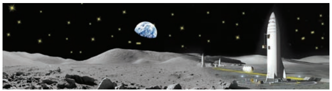
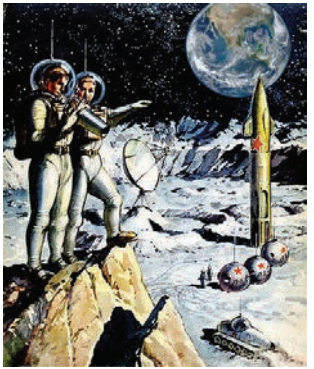

When she came to the Moon she looked around and admired the moonscape: ‘I never realized it was such a beautiful place’. 

He took her along the endless tunnels of Selenopolis, showing her the tall structures, which propped up the star-studded sky.

 ‘It’s so easy to walk here, son!’ 

His mother had still a young, ringing voice: perhaps because she had been such a great singer! So long as he could remember her, she had always liked singing. On holidays, when they had guests, she sang cheerily and enthusiastically, but on weekdays, as she went about the **chores,** her singing was muted and a little sad. She even talked in a singsong manner. Now, too, there was something unusual in her voice – perhaps she was excited because it was her first visit to the Moon! As he listened to her familiar voice that was so dear to him, he wondered why it had this ringing sound.

‘Back home the **orchards** are in bloom.There will be a lot of fruit this year, if only the frosts don’t strike. Will you come for a holiday in the summer?’ 

He almost told her about the **expedition**. The words were on the tip of his tongue, but he checked himself. Why make her worry? Worry. That was it. There was worry in her voice. The words were cheerful but the voice was worried. Had she guessed that this was their parting!

‘It’s easy to walk here,’ he said, ‘but the distances are long. Selenopolis occupies more than a hundred square kilometres. Let’s ride for a bit’.

 A moving pavement covered with green plastic strips rushed them through echoing tunnels and spacious caves with walls sparkling in the light of the **quartz** lamps. The elevator delivered them to the surface. She looked in silence at the enormous lily-shaped tent over a crater that was at least a kilometre in diameter. 

‘The community of Nations Square,’ he told her. ‘People of different nationalities who work in Selenopolis come here after work. And there are some tourists. They’re walking towards the lake. It’s quite an **exotic** experience to have a swim on the Moon.’ 

‘I’m sure it’s better in the river Dnieper when you come to the Earth for your holiday.’
 When they looked at the astrodrome, where two spaceships the size of the Ostankino TV tower were pointed into the black **void** of the universe, she sighed again.

 ‘What are these?’

‘Long–range spaceships, Mother. They’re planning an expedition to a neighbouring galaxy.’

 She screwed up her eyes to look at the rockets where assembly men were busy. They looked quite small from a distance.

 She said quietly: ‘Why should people go off into the unknown? Why ask for trouble?’

 ‘These are very reliable spaceships, Mother!’

 ‘Wouldn’t it make more sense to settle properly on the Moon first, and then on the planets in the solar system, before going further?’ 

It was now his turn to sigh. ‘You may be right, but…’ 

‘But what?’ 

‘How do I know?’ 

He longed to tell her about the flight he was longing for and about how nervous he had been when **confronted** by the selection commission. But he checked himself. It was their last meeting before his **departure**, so why spoil it?

Mothers were all the same, and she was sure to get upset.

 He felt good listening to her. It didn’t matter what she was talking about, he just wanted to hear the voice that was so dear to him.

 ‘Do you know why people settle down on the Moon so easily?’ she was philosophizing. ‘It’s because they are in the gravitation field of their native Earth, under their native Sun. It’s the space allotted to us by nature. But if you leave your Sun…anything might happen…’

 He listened and listened as if drinking water from a spring on the Earth, in the shade of trees. His mother, looking in the direction of the vast blue globe, lowered her voice and continued:

 ‘Look, son, isn’t it a miracle? The Earth floats through space, all by itself.

See the snow-cap on the pole, and the glittering ocean! The cradle of life. And you want to leave this fabulous beauty!’

 He suddenly saw everything with different eyes. He saw how beautiful his native planet was, a real wonder of nature.

 He had never felt that way before. His heart ached. 

‘When will you take your holidays?’ 

‘I don’t know, Mother… That’s why I asked you to come. I don’t know when we’ll see each other again’.

 But he knew very well that there would be no holidays and that his mother was seeing him for the last time. The thought of such a tremendous journey was already sending a chill through his heart. 

‘At least try to come in the Autumn,’ she pleaded, ‘in time for the apples and** pears…** and the water-melons.’

 ‘You think I don’t want to walk barefoot on the dewy grass?’

 ‘Of course, you’ll walk on the dewy grass. And you could visit your relatives and friends’.

 She shrank from the thought that her son might go off into space and be lost to his relatives forever. 

‘They’ve deepened our pond; it’s full of fish now, You like fishing…’

 ‘Operator on duty, …... report to office,’ a voice bellowed from the loudspeaker.

He pushed a button and the screen went dark. His mother fell silent.

 ‘Coming.’ 

He often plays back this recording and he feels as if he is walking again with his mother on the Moon, looking down at his native planet. Their group had gone off to another **galaxy** after all:

 they had left their native Sun, which was now just a 12th - magnitude star, visible through the telescope. And they couldn’t see the Earth at all. Why had they gone? Because they were young. And humanity is young.
