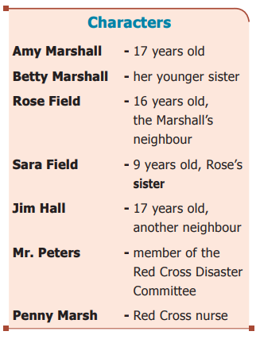
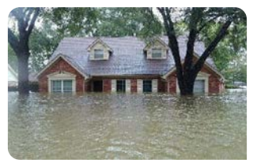
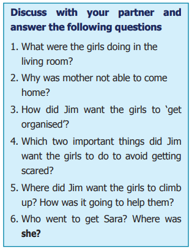
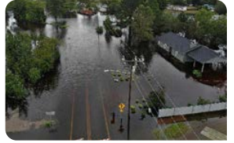
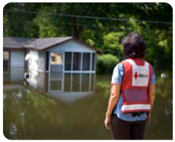

**Time :** Late afternoon in March
**Setting:** Living room of the Marshall home

**Scene - 1**

**At Rise**
 Amy, Betty and Rose are sitting around the living room table. Amy and Rose are knitting. Betty is looking at pictures in a magazine. The stage is not very bright. 

**Rose :**
Goodness, it gets dark early on these rainy days. Mind if I raise the shade a bit, Amy? 

**Amy :**
 No, do, but I guess we need the light on, too. (She goes over and puts on the electric light.)

**Rose :**
(Going to the window) How it rains! In sheets, and look! Your backyard is a small lake.

 **Amy :** (Joining Rose at the window) Gracious! I’ve never seen it rain so hard and this is the third day of it.

 **Betty :**
 (Puts down magazine and runs to the window) Whee..ee! It’s more than a lake, it’s a sea! The radio said the river was above flood stage this morning– whatever that means.

**Amy :**
 It means that the water is above that white line on the bank at Thompson Bridge. It must have covered the south meadows and the highway there.

**Rose :**
 It isn’t only the rain. It’s the snow melting in the hills in the northern part of the state. (The girls return to the table.) Oh, I hope we don’t have a flood here! (There is a noise of stamping feet and someone breathing hard. The girls all look to the right, the direction of the sounds.) 

**Jim Hall :**
 (Entering from right in shining wet rain coat and rain helmet, which he drags off as he enters. He is panting.) Gosh, girls, it’s a cloudburst! (He kicks off his shoes.) I’ve run every step of the way from school to get here. The river is rising fast. The Burnett Dam gave way an hour ago they say and it looks bad! Where is your mother, Amy?

 **Amy :** She took Dick to the dentist and was going to stop at Mrs. Brant’s for a recipe on her way home. She ought to be here soon.

**Jim :**
 And your father? Amy : In Chicago on business, but why all the questions, Jim?

 **Jim :**
 Well, you see... (He is interrupted by the ring of the telephone. Amy exits left to answer it. Her voice can be heard clearly.) 

**Amy :** 
Hello. Yes, Mother – I know. Isn’t it awful? How will you get home? Yes, mother, I’m listening carefully. (Amy’s voice grows very serious) Yes – yes – yes, I will. No, mother, no, I won’t. Jim Hall is here and Rose Field too. Yes, all right, I’ll tell them. Goodbye. (Amy returns to the room. She is looking very scared.) Mother can’t get home from Mrs. Brant’s. The bridges between here and town are under water. Rose, mother says you are to telephone your mother right away and tell her you will spend the night here.

**Rose :** 
I will. That will be fun! (Hurries from the room) 

**Amy :** Betty, you and I are to fill all the bowls, tubs, pails and pitchers with fresh water in case the town supply is cut off or made unsafe to drink. Mother says she hopes you will stay and help us, Jim.

**Jim :**
 That’s just why I came. Amy, I think I’ll look up a lantern and… 

**Betty :**
 (Interrupting) I’ve got a flashlight. I’ll get it and some candles.

**Rose :**
 (From outside, still at the telephone, with irritation) Central! Central! I’m trying to get Main 3022—I can’t – (There is a pause and Rose comes to the door, her face frightened.) The telephone is dead! I can’t get Central. There isn’t even a buzzing on the line!

**Jim :**
 Means the lines are down between here and town! Well, girls, let’s get organized! Betty, look up your flashlight and candles, lamps, lanterns or anything you’ve got. Rose, fill the tubs and pails and Amy and I will check on food, blankets and coats. Better get out the first-aid kit. Everyone make it snappy! (Rose and Betty exit left. Jim turns to Amy.) This is serious, Amy. I don’t want to scare you, but your house is in the direct line of the river. If the dam has given 'way – (He goes to the window.) Well, if it has, you can see for yourself that it means we can’t get out by the main road and we are already cut off from the south side. Look! (He points out of the window. Amy joins him. She **gasps**.)

**Amy :**
 Jim! The water is up around the garage! I thought it was just a pool in the garden, but it’s — it’s... Jim : (Soberly) The river. Yes, Ay, that’s old man river himself creeping up to your door. (Jim and Amy watch it a moment. Amy **shudders**.) 

**Amy :**
 Oh, Jim, I’m scared!

 **Jim :**
 (Placing a hand on her shoulder) Steady, old pal! We’ve been through bad things before and come out safely. Remember the school fire? First thing, we must not let the others see how scared we are. Next, get all the things you can together here: water, food, blankets, coats, lights. I’m glad I served on the Junior Red Cross emergency squad during the war! It’s too bad you live in a bungalow instead of a two-storey house, but we can always climb into the attic and onto the roof.

**Amy :**
 (Still staring out the window) How fast is the river raising, do you think, Jim? 

**Jim :** I don’t know and it might stop before it reaches us. If only the rain would let up! We will signal for help from the roof. They will send a boat or something. 

**Rose :**
 (Entering left) I’ve got enough fresh water to last us a week! Who will send a boat for us, Jim, and from where? (She goes to the window, screams) Horrors! Look at the river! 

**Amy :** Hush, Rose. Don’t tell the others. Jim says we will be all right. Let’s see what food we have on hand. 

**Betty :** (Entering left) Here are the lights. Did you say food? **Hark,** what’s that? (All four stand perfectly still, listening. From far off a child’s voice is heard.) 

**Sara :** Ro-ose! It’s me! Sara!

**Rose :**
Sara! Where is she? (All run to the window.) 

**Amy :** There she is! On the playhouse porch. How did she get there?

 **Rose :**
 Followed me here, probably, she loves that playhouse, the little monkey! 

**Jim :** (Goes out calling) Stay where you are. Sara, I’ll get you.

 **Amy :**
 It’s lucky the playhouse is on high ground. 

**Rose :**
 (Still at the window) But it isn’t. Look it’s nearly afloat! (The girls gather at the window.) There goes Jim. Look, the water is above his knees. 

**Amy :** He will need dry clothes. See if you can find some of Dad’s things for Jim, Betty. Sara can have 

**Dick’s. Rose :**
 There! He’s got her! 

**Amy :** I’ll make some hot cocoa for everyone. (There is a thumping and voices at the right and Jim enters carrying Sara pickaback. Sara is beaming.)

 **Sara :** Hello, everybody! That was fun! Ride some more, please Jim!

 **Jim :**
 No, young lady, that’s enough. You’re heavy. She is dry as a bone, Rose. I’m not!

 **Amy :**
 You can have some of Dad’s things. I’m going to get us some supper (As she says this, the lights go out. They all gasp and Betty screams.) 

**Jim :** (Trying to sound casual) Power house must be out of commission. Light your candles, Betty. (Betty switches on the flashlight and lights three candles.) 

**Amy :** I’m glad we have an oil stove for cooking. 

**Rose :**
 (Taking a candle) Forward march to the kitchen! (Betty takes a candle and follows, with Sara trailing, all exit right, humming ‘Tramp, tramp, tramp the boys are marching’) 

**Jim :** (In a low voice to Amy) The river was up another foot, Amy. Another hour and that playhouse would have been floating out in the current. At this rate the floor here will be under water by morning. 

**Amy :** What will we do then, Jim? Neither Sara nor Betty is a strong swimmer. 

**Jim :**
 I’m going to climb out on the roof and start waving the flashlight. Someone will see it and come for us. 

**Amy :** But who? No one is on the main road and there are no houses within sight of us.

That will be just a pinpoint of light. Aren’t you scared? 

**Jim :**
 You bet! Are you?

 **Amy :** Terrified. But I’m glad you’re here. 

**Jim :** We’ll see it through. If we just keep our heads.

**- Curtain -**

**Scene – 2**

**Time :** An hour later.
**Setting :** The same.

**At Rise** 
Same group is in the living room with the exception of Jim. Sara is asleep, covered with a blanket, in a big chair. Amy, Rose and Betty have three candles on the table. Betty is trying to read.

 **Betty :** (Putting down her book with a thud) I can’t read by this light. How do you suppose our grandmothers ever did? 

**Rose :**
 I don’t believe they tried to read. I guess they went to bed when it grew dark. 

**Amy :**
 Maybe we ought to go to bed. It’s nearly eleven, but I couldn’t sleep a wink. 

**Betty :**
 Nor I.

 **Rose :**
 Nor I. Listen, what’s that noise? (All three listen. Rose, running to the window and peering out) I can’t see a thing. It's pitch dark. It sounded like something bumping against the house. 

**Betty :**
 (Nervously) Oh, come back! Let's stick here together. 

**Jim :**
 (Entering left, in rain coat, carrying flashlight) Battery's dead. I waved italmost a hundred times, though. Maybe somebody saw it.

 **Amy :**
 Yes, we — (There is a terrific crash, followed by a wail of pain and a scream.) 

**Rose :**
 (Offstage left) Oh, Sara! She’s fallen off the step ladder! Come quick, somebody! I’ve dropped my candle and it’s gone out! (Mr. Peters, Miss Marsh, who is carrying a small black bag, and Amy rush off stage, left.) 

**Betty :**
 Oh, I hope she hasn’t broken her neck! 

**Jim :**
 Get the first-aid box. It’s in that pile of coats. I’ll fix a place for her to lie down. (He arranges chairs so Sara can lie down.) 

**Mr. Peters :**
 (enters left carrying Sara) Steady now, you are all right. More frightened than hurt, I think. (He places Sara on the chairs.) 

**Amy :**
 (Placing the lantern near Sara) I’m glad Miss Marsh is here! (Miss Marsh is examining Sara. Sara is sobbing softly, saying every so often ‘It hurts.’ Rose kneels beside Sara’s chair; holding her hand, Jim stands in the background with Betty.) 

**Sara :**
 It’s my leg that hurts! Miss 

**Marsh :**
 Yes, you have hurtit badly, Sara, but we can fix it up and we will all get into the boat and take you home. You are going to be alright. (She motions to Mr. Peters, Jim and Amy to move to
one side of the stage. Rose stays with Sara.) She has broken her right leg just below the knee. We can **splint** it up with pillows and umbrella and lift her safely into the boat. I think we ought to take her to the emergency Red Cross hospital in the Armoury.

Mr. Peters : We can take Rose and Betty along too, but Jim, you and Amy will have to stay until we can get back for you or send some other boat. (Miss Marsh returns to surround Sara’s right leg with pillows, using an umbrella and cane along the outside to keep the leg stiff.)

**Jim :**
That’s all right, we will be perfectly safe up on the roof.

**Mr. Peters :**
 We can leave you an extra lantern and a jar of coffee, need anything else? 

**Amy :**
 Only some of your calmness! We will be all right, thanks. 

**Mr. Peters :**
 Don’t thank me, thank the Red Cross. (He goes over to Sara and helps lift her into a blanket rolled to form a stretcher. Miss Marsh picks up her bag. Jim and Mr.Peters lift and carry Sara toward the right.) We can swing her down into the boat very easily. It won’t hurt a mite, Sara.Get your things, Rose and Betty, you are going with us. (Rose and Betty grab their coats. Betty takes her dress box.)

**Sara :**
 (drowsily) Miss Marsh gave me something to stop the hurt. It has almost gone! 

**Amy :**
 (at the door, dropping a kiss on Sara’s forehead as they carry her out) That’s fine dear! Have a nice boat ride! (She waves as the stretcher goes out, followed by Rose and Betty.) Try to get word to Mother that we are all right, Betty, and to Jim’s family, too! 

**Betty :**
 I’ll try. I hope you’ll be rescued soon. Bye. 

**Rose :**
 Good-bye Amy, good luck! 

**Amy :**
 Good-bye. (There is more thumping, only less loud than before, and voices giving directions. Amy fusses with the lantern, trying to get it lighted.) 

**Mr. Peters :**
 (off stage) You will be all right, Jim? 

**Jim:**
 (still offstage) Yes don’t worry about us. Goodbye. (Voices in distance, the sound of oars. Jim enters right, wiping his forehead. Amy gets the lantern lighted and blows out candles.) Water’s dropping! (He pours two cups of coffee from Mr. Peters' jar. Hands one to Amy. Raises his cup as though in a toast.) Here’s to the coffee, lantern and rescue! I’m glad we have a wide–awake, well-equipped Disaster Committee in this town! 

**Amy :**
 And a Red Cross nurse for emergencies! Thank God for the rescue! (Both lift the coffee cups and drink, still standing.) 

**- Curtain -**

