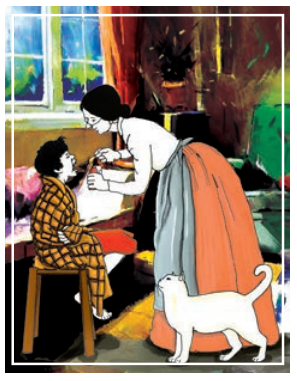
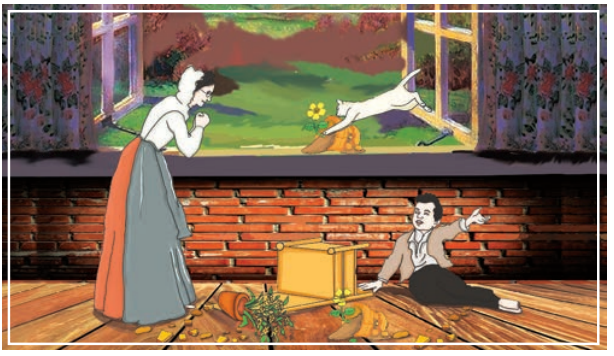

Becky Thatcher, his friend, had stopped coming to school. This disturbed Tom. He became unhappy. The charm of life was gone; there was nothing but boredom left. He put his hoop away, and his bat; there was no joy in them anymore and so his aunt Polly was concerned. She was **infatuated** with patent medicines and all new methods of producing health or mending it. She was an incurable experimenter in these things. 

She began to try all manners of remedies on Tom. The water treatment was new, now, and Tom’s low condition was a windfall to her. She had him out at daylight every morning, stood by him up in the wood-shed and drowned him in cold water; then she rubbed him hard down with a towel like a file; then she rolled him up in a wet sheet and put him away under blankets. 

Yet not withstanding all this, the boy grew more and more sad and pale and dejected. She added hot baths, sitz baths, shower baths, and **plunges**. The boy remained bored. She began to assist the water with a slim oatmeal diet and blister-plasters. She calculated his capacity and filled him up every day with **quack** cure-alls. He became fed up and so he thought over various plans of relief, and finally hit upon that of **professing** to be fond of pain-killer. He asked for it so often that he became a nuisance, and his aunt ended by telling him to help himself and quit bothering her.

 She found that the medicine did really diminish, but it did not occur to her that the boy was mending the health of a crack in the sitting room floor with it

One day Tom was in the act of dosing the crack when his aunt’s cat Peter

came along purring, eyeing the teaspoon greedily, and begging for a taste. Tom said, ‘Don’t ask for it unless you want it, Peter’.

 But Peter signified that he did want it.

 ‘You better make sure.’

 Peter was sure.

 ‘Now you’ve asked for it, and I’ll give it to you, because there ain’t anything mean about me; but if you find you don’t like it, you mustn’t blame anybody but your own self.’ 

Peter was agreeable. So Tom opened his mouth and poured down the pain-killer. Peter sprang a couple of yards in the air, and then delivered a war-whoop and set off round and round the room, banging against furniture, upsetting flower-pots, and making general confusion. Next he rose on his hind feet and danced around, in a **frenzy** of enjoyment, with  his head over his shoulder and his voice proclaiming his happiness. Then he went tearing around the house again spreading chaos and destruction in his path. Aunt Polly entered in time to see him throw a few double **somersaults**, deliver a final mighty hurrah, and sail through the open window, carrying the rest of the flower-pots with him. The old lady stood **petrified** with astonishment, peering over her glasses; Tom lay on the floor expiring with laughter.

 ‘Tom, what on earth ails that cat?’

 ‘I don’t know, aunt,’ gasped the boy. 

‘Why, I never see anything like it. What did make him act so?’ ‘Deed I don’t know, Aunt Polly; cats always act so when they’re having good time.’ ‘They do, do they?’ There was something in the tone of that made Tom apprehensive.

‘Yes’m. That is, I believe they do.’

 ‘You do?’

 ‘Yes’m.’ 

The old lady bent down and took the teaspoon and held it out! Tom winced and dropped his eyes. Aunt Polly raised him by the usual handle – his ear – and cracked his head soundly with her thimble. 

‘Now, sir, what did you want to treat that poor dumb beast so, for?’

 ‘I done it out of pity for him - because he hadn’t any aunt.’ ‘Hadn’t any aunt! –

 you numbskull. What has that got to do that with it?’ 

‘Heaps. Because if he’d had one she’d burnt him out herself! She’d a roasted bowel out of him ‘thout any more feeling than if he was a human!’ 

Aunt Polly felt a sudden painful regret. This was putting the thing in a new light; what was cruelty to a cat might be cruelty to a boy too. She began to soften; she felt sorry. Her eyes watered a little, and she put her hand on Tom’s head and said gently: 

‘I was meaning for the best, Tom. And, Tom, it did do you good.’ 

Tom looked up in her face with just a recognisable twinkle peeping through his gravity.

 ‘I know you was meaning for the best, aunty, and so was I with Peter. It done him good, too. I never see him around so since’

 ‘Oh, go ‘long with you, Tom, before you annoy me again. And you try and see if you can’t be a good boy, for once, and you needn’t take any more medicine.’

 **About The Author**

**Samuel Langhorne Clemens** (1835-1910), better known by his pen name Mark Twain, was an American writer, humourist, entrepreneur, publisher and lecturer. Twain was raised in Hannibal, Missouri, which later provided the setting for his novels. His famous works are **The Adventures of Tom Sawyer and The Adventures of Huckleberry Finn**.
