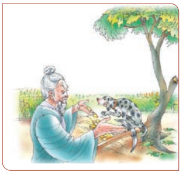

In the old, old days, there lived an honest man with his wife, who had a pet dog, which they used to feed with fish and **tit-bit** from their own kitchen. One day, as the old folks went out to work in their garden, the dog went with them, and began playing about. All of a sudden, the dog stopped short, and began to bark, “Bow, wow, wow!” **wagging**  his tail **violently.** 

The old people thought that there must be something nice to eat under the ground, so they brought a spade and began digging, when, lo and behold! The place was full of gold pieces and silver, and all sorts of precious things, which had been buried there. So, they gathered the treasure and after giving alms to the poor, bought themselves rice-fields and corn-fields, and became wealthy people.

Now, in the neighbouring house there dwelt a **covetous** and stingy old couple, who when they heard what had happened, came and borrowed the dog and having taken him

home, prepared a great feast for him, and said— “If you please, Mr. Dog, we should be much **obliged** to you if you would show us a place with plenty of money in it.” The dog, however, who up to that time had received nothing but cuffs and kicks

from his hosts, would not eat any of the dainties which they set before him; so, the old people began to get cross, and, putting a rope around the dog’s neck, led him out into the garden. But it was all in vain; he let them lead him where they might, not a sound would the dog utter. He had no “bow-wow” for them. At last, however, the dog stopped at a certain spot, and began to sniff. So, thinking that this must surely be the lucky place, they dug, and found nothing but a quantity of dirt and nasty offal, over which they had to hold their noses. Furious at being disappointed, the wicked old couple seized the dog, and killed him.

 When the good old man saw that the dog, whom he had lent, did not come home, he went next door to ask what had become of him; and the wicked old man answered that he had killed the dog and buried him at the root of a pine-tree; so the good old fellow, with a heavy heart, went to the spot, and having set out a tray with delicious food, he burnt incense, and adorned the grave with flowers, as he shed tears over his lost pet. 

That night, when the good old man was fast asleep in bed, the dog appeared to him, and, after thanking him for all his kindness, said “Cause the pine-tree, under which I am buried, to be cut down and made into a **mortar**, and use it, thinking of it as if it were myself.”

 The old man did as the dog had told him to do, and made a mortar out of the wood of the pine-tree; but when he ground his rice in it, each grain of rice turned into some rich treasure. When the wicked old couple saw this, they came to borrow the mortar; but no sooner did they try to use it, all their rice turned into filth; so, in a fit of rage, they broke the mortar and burnt it. But the

 

 good old man, little suspecting that his precious mortar had been broken and burnt, wondered why his neighbours did not bring it back to him.

 One night the dog appeared to him again in a dream, and told him what had happened, adding that if he would take the ashes of the burnt mortar and sprinkle them on **withered** trees, the trees would revive, and suddenly put out flowers. After saying this the dream vanished, and the old man, who heard for the first time of the loss of his mortar, ran out weeping to the neighbours’ house, and begged them, at any rate, to give him back the ashes of his treasure.

 Having obtained it, he returned home, and made a trial of their virtues upon a withered cherry tree, which, upon being touched by the ashes, immediately began to sprout and blossom. When he saw this wonderful effect, he put the ashes into a basket, and went about the country, announcing himself as an old man who had the power of bringing dead trees to life again.

 

 A certain prince, hearing of this, and thinking it a mighty strange thing, sent for the old fellow, who showed his power by causing all the withered plum and cherry trees to shoot out and put forth flowers. So, the prince gave him a rich reward of pieces of silk and cloth and other presents, and sent him home rejoicing.

 As soon as the neighbours heard of this they collected all the ashes that remained, and having put them in a basket, the wicked old man went out into the castle town, and gave out that he was the old man who had the power of reviving dead trees, and causing them to flower. He had not to wait long before he was called into the prince’s palace, and ordered to exhibit his power.

 But when he climbed up into a withered tree, and began to scatter the ashes, not
a bud or flower appeared; but the ashes all flew into the prince’s eyes and mouth, blinding and choking him. When the prince’s retainers saw this, they seized the old man, and beat him almost to death, so that he crawled off home in a very sorry plight. When he and his wife found out what a trap they had fallen into, they scolded themselves. 

The good old man and woman, as soon as they heard of their neighbours’ distress, sent for them, and, after reproving them for their greed and cruelty, gave them a share of their own riches, which, by repeated strokes of luck, had now increased to a goodly sum. So, the wicked old people mended their ways, and led good and virtuous lives ever after.

