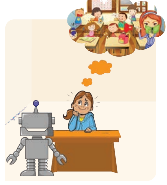

Margie even wrote about it that night in her diary. On the page headed 17 May 2157, she wrote, “Today Tommy found a real book!” 

It was a very old book. Margie’s grandfather once said that when he was a little boy his grandfather told him that there was a time when all stories were printed on paper.

 They turned the pages, which were yellow and **crinkly**, and it was **awfully**  funny to read words that stood still instead of moving the way they were supposed to-on a screen, you know. And then when turned back to the page before, it had the same words on it that it had when they read it the first time.

“Gee!,” said Tommy, “What a waste. When you’re through with the book, you just throw it away,
 I guess. Our television screen must have had a million books on it and it’s good for plenty more. I wouldn’t throw it away.” “Same with mine,” said Margie. She was eleven and hadn’t seen as many telebooks as Tommy had. He was thirteen. 

She said, “Where did you find it?” 
“In my house”. He pointed without looking, because he was busy reading. “In the **attic.**”

“What’s it about?”

 “School.”

Margie was **scornful.** “School ? 

What’s there to write about school? I hate school.” Margie always hated school, but now she hated it more than ever. The mechanical teacher had been giving her test after test in geography and she had been doing worse and worse until her mother had shaken her head sorrowfully and sent for the county inspector

He was a round little man with a red face and a whole box of tools with dials and wires. He smiled at Margie and gave her an apple, then took the teacher apart. Margie had hoped he wouldn’t know how to put it together again, but he knew how all right, and, after an hour or so, there it was again, large and black and ugly, with a big screen on which all the lessons were shown and the questions were asked. That wasn’t so bad. The part Margie hated most was the slot where she had to put homework and test papers. She always had to write them out in a punch code they made her learn when she was six years old, and the mechanical teacher calculated the marks in no time.

The inspector had smiled after he was finished and patted Margie’s head. He said to her mother, “It’s not the little girl’s fault, Mrs. Jones. I think the geography sector was geared a little too quickly. Those things happen sometimes. I’ve slowed it up to an average ten year level. Actually, the overall pattern of her progress is quite satisfactory.” And he patted Margie’s head again. 

Margie was disappointed. She had been hoping they would take the teacher away altogether. They had once taken Tommy’s teacher away for nearly a month because the history sector had blanked out completely. 

So she said to Tommy, “Why would anyone write about school?”

 Tommy looked at her with very superior eyes. “Because it’s not our kind of school, stupid. This is the old kind of school that they had hundreds and hundreds of years ago.” He added **loftily** pronouncing the word carefully, **“Centuries ago.” ** Margie was hurt. “Well I don’t know what kind of school they had all that time ago.”

 She read the book over his shoulder for a while, then said, “Anyway, they had a teacher.” 

“Sure they had a teacher, but it was not a regular teacher. It was a human.” 

“A human? How could a human be a teacher?”

 “Well, she told boys and girls things and gave them homework and asked them questions.” 

“A human isn’t smart enough.”

 “Sure one is.” Margie wasn’t prepared to dispute that. She said, “I wouldn’t want a stranger in my house to teach me.” Tommy screamed with laughter. “You don’t know much, Margie. The teachers didn’t live in the house. They had a special building and all the kids went there.” 

“And all the kids learned the same thing?”

 “Sure, if they were the same age.”

 “But my mother says a teacher has to be adjusted to fit the mind of each boy and girl it teaches and that each kid has to be taught differently.” 

“Just the same they didn’t do it that way then. If you don’t like it, you don’t have to read the book.” “I didn’t say I didn’t like it,” Margie said quickly. She wanted to read about those funny schools. They weren’t even half finished when Margie’s mother called, “Margie! School!” Margie looked up. “Not yet, Mamma.”

 “Now!” said Mrs. Jones. “And it’s probably time for Tommy, too.” Margie said to Tommy, “Can I read the book some more with you after school?”

 “Maybe,” he said **nonchalantly**. He walked away whistling, the dusty old book tucked beneath his arm.

Margie went into the schoolroom. It was right next to her bedroom, and the mechanical teacher was on and waiting for her. It was always on at the same time every day except Saturday and Sunday, because her mother said little girls learned better if they learned at regular hours.

The screen was lit up, and it said: “Today’s arithmetic lesson is on the addition of proper fractions. Please insert yesterday’s homework in the proper slot.

” Margie did so with a sigh. She was thinking about the old schools they had when her grandfather’s grandfather was a little boy. All the kids from the whole neighborhood came, laughing and shouting in the schoolyard, sitting together in the schoolroom, going home together at the end of the day. They learned the same things, so they could help one another with the home work and talk about it.

And the teachers were people… 

The mechanical teacher was flashing on the screen: “When we add fractions ½ and ¼… Margie was thinking about how the kids must have loved it in the old days. She was thinking about the fun they had.

**About The Author**

**Isaac Asimov**, born on January 2nd, 1920 was an 
American writer and professor of Biochemistry at Boston University. He was known for his work of science fiction and 'popular science'. Asimov was a prolific writer and edited more than 500 books, an estimated 90,000 letters and postcards. Asimov wrote 'Hard Science Fiction' along with Robert A. Heinlein and Arthur C. Clarke. He was considered one of the best science fiction writers during his lifetime

