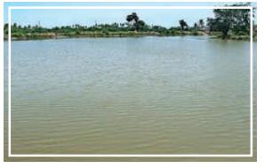

Man has through the ages sought in vain for an imaginary elixir of life, the divine Amrita, a draught of which was thought to confer immortality. But the true elixir of life lies near our hands; for it is the commonest of all liquids, plain water! I remember one day standing on the line which separates the Libyan Desert from the Valley of the Nile in Egypt.

On one side was visible a sea of **billowing** sand without a speck of green or a single living thing anywhere on it. On the other side lay one of the greatest, most fertile and densely populated areas

to be found anywhere on the earth, **teeming** with life and vegetation. What made this wonderful difference? Why, it is the water of the river Nile flowing down to the Mediterranean from its sources a couple of thousands of miles away. Geologists tell us that the entire soil of the Nile valley is the creation of the river itself, brought down as the finest silt in its flood waters, from the highlands of Abyssinia and from remote Central Africa, and laid down through the ages in the trough through which the Nile flows into the sea. Egypt, in fact, was made by its river. Its ancient civilization was created and is sustained by the life-giving waters which come down year after year with unfailing regularity.

**** What is the imaginary elixir of life?
 **** What according to the writer is the real elixir of life?
 **** What is the ‘wonderful difference’ the writer talks about in the passage?

I give this example and could give many others to emphasis that this common substance which we take for granted in our everyday life is the most potent and the most wonderful thing on the face of our earth. It has played a role of vast significance in shaping the course of the earth’s history and continues to play the leading role in the drama of life on the surface of our planet.

 There is nothing which adds so much to the beauty of the countryside as water, be it just a little stream **trickling** over the rocks or a little pond by the wayside, where the cattle quench their thirst of an

evening. The rainfed tanks that are so common in South India – Alas! often so sadly neglected in their maintenance – are a cheering sight when they are full. They are, of course, shallow, but this is less evident since the water is silt-laden and throws the light back, and the bottom does not therefore show up. These tanks play a vital role in South Indian agriculture. Some of these tanks are surprisingly large and it is a beautiful sight to see the sun rise or set over one of them. Water in a landscape may be compared to the eyes in a human face. It reflects the mood of the hour, being bright and gay when the sun shines, turning to dark and gloomy when the sky is overcast.

**** What is the ‘cheering sight’ mentioned in the paragraph? 
**** What does the writer compare water in a landscape to?

One of the most remarkable facts about water is its power to carry silt or finely divided soil in suspension. This is the origin of the characteristic colour of the water in rainfed tanks. This colour varies with the nature of the earth in the** catchment** area and is most vivid immediately after a fresh inflow following rain. Swiftly flowing water can carry fairly large and heavy particles. The finest particles, however, remain floating within the liquid in spite of their greater density and are carried to great distances. Such particles are, of course, extremely small, but their number is also great and incredibly large amounts of solid matter can be transported in this way. 

When silt-laden water mixes with the salt water of the sea, there is rapid **precipitation** of the suspended matter. This can be readily seen when one travels by steamer down a great river to the deep sea. The colour of the water changes successively from the muddy red or brown of silt through varying shades of yellow and green finally to the blue of the deep sea. That great tracts of land have been formed by silt thus deposited is evident on an examination of the soil in alluvial areas. Such land, consisting as it does of finely divided matter, is usually very fertile.

**** How does the water in rainfed tanks get its colour?

The flow of water has undoubtedly played a great part and a beneficent one in the geological processes by which the soil on the earth’s surface has been formed from the rocks of its **crus**t. The same agency, however, under appropriate conditions, can also play a destructive part and wash away the soil which is the foundation of all agriculture, and if allowed to proceed unchecked can have the most disastrous effect on the life of the country. The problem of soil erosion is one of serious import in various countries and especially in many parts of India. The conditions under which it occurs and the measures by which it can be checked are deserving of the closest study.

 Soil erosion occurs in successive steps, the earliest of which may easily pass unnoticed. In the later stages, the cutting up and washing away of the earth is only too painfully apparent in the formation of deep gullies and ravines which make all agriculture impossible. Sudden bursts of excessively heavy rain resulting in a large run of surplus water are the principal factors in causing soil erosion. Contributory causes are the slope of the land, removal of the natural protective coat of vegetation, the existence of ruts along which the water can flow with rapidly gathering momentum, and the absence of any checks of such flow. Incredibly large quantities of precious soil can be washed away if such conditions exist, as is too often the case.

**** What is the main cause of soil erosion?
**** What other factors add to the erosion of precious soil?

The menace which soil erosion presents to the continuance of successful agriculture is an alarming one in many parts of India, calling urgently for attention and preventive action. The terracing of land, construction of bunds to check the flow of water, the practice of contour cultivation and the planting of appropriate types of vegetation are amongst the measure that have been suggested. It is obvious that the aim should be to check the flow of water at the earliest possible stage before it has acquired any appreciable momentum and correspondingly large destructive power

**** How can soil erosion be prevented?

Water is the basis of all life. Every animal or plant contains a substantial proportion of free or combined water in its body, and no kind of physiological activity is possible in which the fluid does not play an essential part. Water is, of course, necessary for animal life, while moisture in the soil is equally imperative for the life and growth of plants and trees though the quantity necessary varies enormously with the species. The conservation and utilization of water is thus fundamental for human welfare. Apart from artesian water the ultimate source in all cases is rain or snowfall. Much of Indian agriculture depends on seasonal rainfall and is therefore very sensitive to any failure or irregularity of the same. The problems of soil erosion and of inadequate or irregular rainfall are

closely connected with each other. It is clear that the adoption of techniques preventing soil erosion would also help to conserve and keep the water where it is wanted, in other words, on and in the soil, and such techniques therefore serve a double purpose.

**** How does prevention of soil erosion serve a double purpose? 
**** What are the two sources of water?

It is evident, however, that in a country having only a seasonal rainfall, an immense quantity of rain-water must necessarily run off the ground. The collection and utilization of this water is, therefore, of vital importance. Much of it flows down into the streams and rivers and ultimately finds its way to the sea. Incredibly large quantities of the precious fluid are thus lost to the country. The harnessing of our rivers, the waters of which now mostly run to waste, is a great national problem which must be considered and dealt with on national lines. Vast areas of land which at present are mere scrub jungle could be turned into fertile and prosperous country by courageous and well-planned action. 

**** What happens to the rain water?

Closely connected with the conservation of water supplies is the problem of afforestation. The systematic planting of suitable trees in every possible or even in impossible areas, and the development of what one can call civilized forests, as distinguished from wild and untamed jungle, is one of the most urgent needs of India. Such plantation would directly and indirectly prove a source of untold wealth to the country. They would check soil erosion and conserve the rainfall of the country from flowing away to waste, and would provide the necessary supplies of cheap fuel, and thus render unnecessary the wasteful conversion of farmyard manure into a form of fuel. 

**** What is the idea of civilized forest?
**** How can you check soil erosion?
The measures necessary to control the movement of water and conserve the supplies of it can also serve subsidiary purposes of value to the life of the countryside. By far the cheapest form of internal transport in a country is by boats and **barges** through canals and rivers. We hear much about programmes of rails and road construction, but far too little about the development of internal waterways in India. Then, again the harnessing of water supplies usually also makes possible the development of hydro-electric power. The availability of electric power would make a tremendous difference to the life of the countryside and enable rural economy to be improved in various directions.

**** What is the cheapest means of transport? 
**** How can you make a difference in the countryside?

In one sense, water is the commonest of liquids. In another sense, it is the most uncommon of liquids with amazing properties which are responsible for its unique power of maintaining animal and plant life. The investigation of the nature and properties of water is, therefore, of the highest scientific interest and is far from an exhausted field of research.

**About The Author**

**Sir Chandrasekhara Venkata Raman (7 November 1888 – 21 November 1970) was an Indian physicist born in Tiruchirappalli**. He carried out ground-breaking work in the field of light scattering, which earned him the 1930 Nobel Prize for Physics. He discovered that when light traverses a transparent material, some of the deflected light changes wavelength. This phenomenon, subsequently known as Raman scattering, results from the Raman effect and to commemorate it, February-28 iscelebrated as National Science Day. In 1954, India honoured him with its highest civilian award, the Bharat Ratna.

